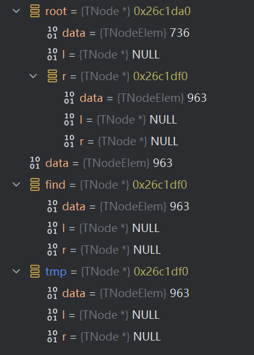
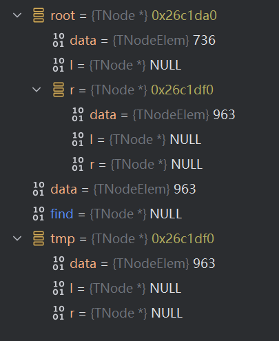

# 心得

### CPP

```cpp
struct TNode {
	int data;
	TNode *l, *r;
};
int main(){
	TNode* root;
    deleteTreeNode(root);
}
void deleteTreeNode(TNode *&node) {
	TNode* find = binarySearch(node,data);
	TNode* tmp = find;//初始状态
	find = nullptr;//第一步
	delete tmp;//第二步
}
```



下面三幅图分别对应初始状态，第一步和第二步

可以看到，find、tmp都对应着原本树中data为963的节点的地址0x26c1df0。

第一步将find设为null，但是树中同样地址的节点却没有被设为null，这是因为指针**变量**本身是一个装着地址的盒子，将变量设为null只是把盒子里的东西变为了null，并没有改变这个地址本身。同样的道理，如果把find=nullptr这一句变为find->data=1，那么原本树中的这个节点也会变为1，这是因为我们进行的改变不再是直接把盒子里的东西变为null，而是依靠盒子里的地址修改了这个地址里所储存的TNode对象的data字段的值。

第二步delete tmp，可以看到树中和tmp中的值都被初始化了，这和前面的find->data=1是同样的道理，只不过delete是一种更加简单粗暴的擦除。这些修改是对于0x26c1df0这个地址的对象本身的。

所以，想要做到让0x26c1da0的r变为完全的NULL，必须要从0x26c1da0这个对象本身入手，像修改find的data字段一样修改0x26c1da0的r字段，设置为NULL。

